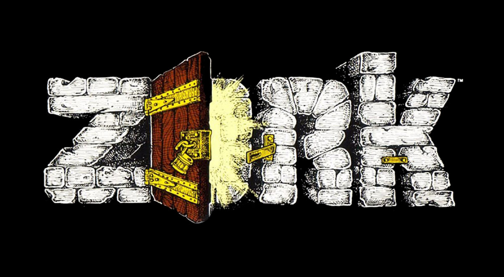
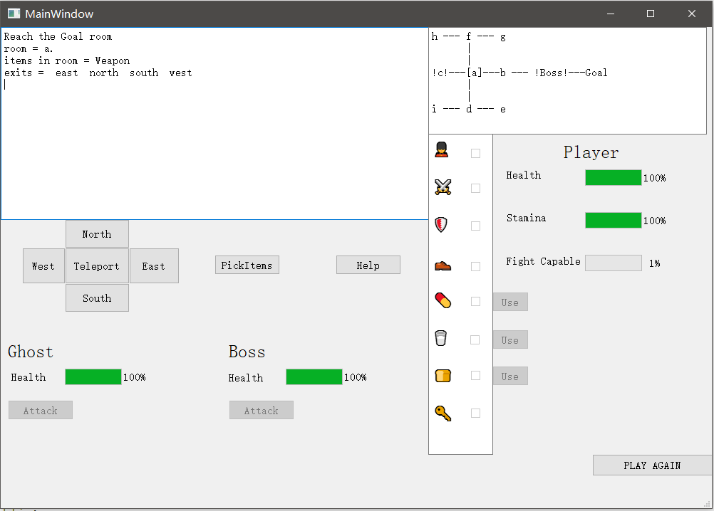

# Zork_Game
 

   
   
   

    A game logic example for Zork
     
    

   
 

## Build with
:running:Zeyuan Song(2605623s) 

## Prerequisites
QT5 creator 4.11.1 with GUI 

## License
Project is distributed under <a href="https://github.com/zeyuan-song0204/Remote-infrared-thermometer-/blob/main/LICENSE">MIT License</a>
## Contact
Zeyuan Song - 2605623s@student.gla.ac.uk

